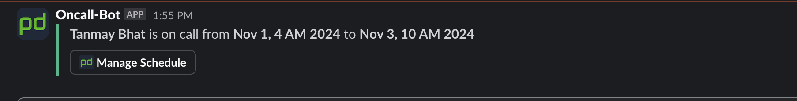

# PagerDuty On-Call Slack Reporter

This project retrieves on-call user details from PagerDuty and sends a formatted message to a specified Slack channel using a Slack webhook.

## Prerequisites

- Go 1.16 or later
- PagerDuty account with API access
- Slack workspace with an incoming webhook configured

## Environment Variables

The following environment variables must be set:

- `PAGERDUTY_AUTH_TOKEN`: Your PagerDuty API token.
- `SLACK_WEBHOOK_URL`: The Slack webhook URL to send messages to.
- `PAGERDUTY_SCHEDULE_ID`: The ID of the PagerDuty schedule to retrieve on-call details from.

## Installation

1. Clone the repository:

   ```sh
   git clone https://github.com/yourusername/pagerduty-oncall-slack-reporter.git
   cd pagerduty-oncall-slack-reporter

2. Install the dependencies:

   ```sh
   go mod tidy
   ```

## Usage

1. Set the required environment variables:

   ```sh
   export PAGERDUTY_AUTH_TOKEN=your-pagerduty-api-token
   export SLACK_WEBHOOK_URL=your-slack-webhook-url
   export PAGERDUTY_SCHEDULE_ID=your-pagerduty-schedule-id
   ```

2. Run the application:

   ```sh
   go run main.go
   ```

## Example Message

